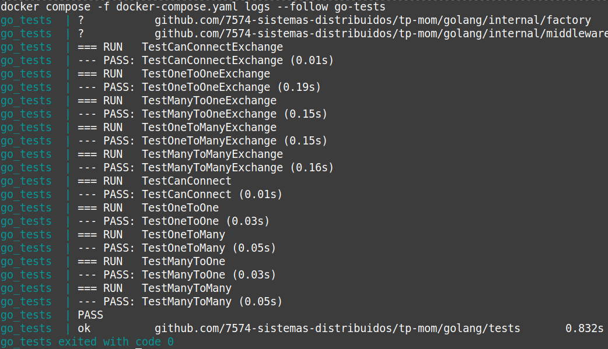

# Trabajo Práctico - Middlewares Orientados a Mensajes

Los middlewares orientados a mensajes (MOMs) son un recurso importante para el control de la complejidad en los sistemas distribuídos, puesto que permiten a las distintas partes del sistema comunicarse abstrayéndose de problemas como los cambios de ubicación, fallos, performance y escalabilidad.

En este repositorio se proveen conjuntos de pruebas para los dos formas más comunes de organización de la comunicación sobre colas, que en RabbitMQ se denominan Work Queues y Exchanges.

Se recomienda familiarizarse con estos conceptos leyendo la documentación de RabbitMQ y siguiendo los [tutoriales introductorios](https://www.rabbitmq.com/tutorials).

## Condiciones de Entrega

El código de este repositorio se agrupa en dos carpetas, una para Python y otra para Golang. Los estudiantes deberán elegir **sólo uno** de estos lenguajes y completar la implementación de las interfaces de middleware provistas con el objetivo de pasar las pruebas asociadas.

Al momento de la evaluación y ejecución de las pruebas se **descartarán** los cambios realizados a todos los archivos, a excepción de:

**Python:** `/python/src/common/middleware/middleware_rabbitmq.py` 

**Golang:** `/golang/internal/factory/*/*.go` 

## Ejecución

`make up` : Inicia contenedores de RabbitMQ  y de pruebas de integración. Comienza a seguir los logs de las pruebas.

`make down`:   Detiene los contenedores de pruebas y destruye los recursos asociados.

`make logs`: Sigue los logs de todos los contenedores en un solo flujo de salida.

`make local`: Ejecuta las pruebas de integración desde el Host, facilitando el desarrollo. Se explica con mayor detalle dentro de su sección.

## Pruebas locales desde el Host

Habiendo iniciado el contenedor de RabbitMQ o configurado una instancia local del mismo pueden ejecutarse las pruebas sin necesidad de detener y reiniciar los contenedores ejecutando `make local`, siempre que se cumplan los siguientes requisitos.

### Python
Instalar una versión de Python superior a `3.14`. Se recomienda emplear un gestor de versiones, como ser `pyenv`.
Instalar los dependencias de la suite de pruebas:
`pip install -r python/src/tests/requirements.txt`

### Golang
Instalar una versión de Golang superior a `1.24`.
Instalar los dependencias de la suite de pruebas:
`go mod download`

## Entrega

Se desarrolló el ejercicio en Golang con todos los archivos en la ruta pedida por la consigna:
`/golang/internal/factory/*.go`.

### Aclaraciones

- Para evitar race conditions sobre los channels de RabbitMQ, se optó por generar un canal para publicar y otro diferente para consumir, de esta manera se puede tener externamente una rutina dedicada a cada trabajo.

- `StartConsuming()` es sincrónico y bloqueante, no se puede hacer asincrónico usando una rutina para el loop de consumo ya que se perderían los posibles mensajes de errores, esta limitación se debe a la firma de la interfaz, específicamente la del parámetro `callbackFunc`; en una futura implementación se puede manejar mejor si la `callbackFunc` permite recibir un canal donde se envíen los errores de la rutina.

- Para generar un consumerTag único se creó una función `SimpleCryptoID()` que para este trabajo cumple; en una implementación más robusta y con permiso de la cátedra, se debería usar la librería de `uuid`.

- Se extrajo gran parte de la lógica repetida a un `baseMiddleware`.

- Al llamar a `StopConsuming()` se "cancela" el canal de consumo, esto le indica a Rabbit que no envíe más mensajes a ese canal, posteriormente se espera a que se terminen de procesar los mensajes remanentes; esta implementación es válida únicamente si el procesamiento de mensajes es corto; de no serlo, se puede optar por cerrar directamente el canal y que Rabbit maneje los errores (ya que no podrá recibir ack o nack de estos mensajes perdidos). Esto también ocurre al usar `Close()`, ya que este llama a `StopConsuming()` internamente.

- Las flags de durabilidad están puestas en false por simplicidad; en una implementación futura pueden cambiar o, mejor aún, ser configurables.

### Resultados de Tests

